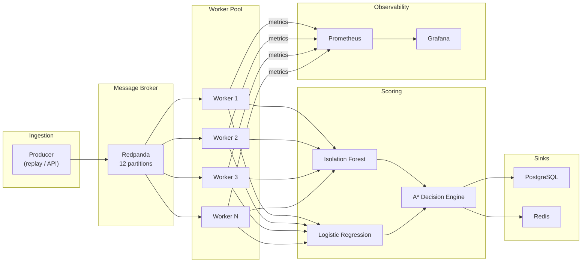

# 🧠 SentinelAI

### A Distributed, Real-Time Fraud Scoring Pipeline with Explainable AI

[](https://github.com/Radhikapatel-code/SentinelAI/actions/workflows/ci.yml)
[](https://www.python.org/downloads/)
[](https://opensource.org/licenses/MIT)

[🚀 Live Dashboard](https://huggingface.co/spaces/raddhika/SentinelAI) | [📚 API Docs](https://sentinelai-uzhn.onrender.com/docs)


---

## 📌 Overview

**SentinelAI** is a horizontally-scalable fraud detection system that combines **ML anomaly detection**, **cost-aware A\* search**, and **real-time streaming** to score financial transactions at **500+ tx/sec** with sub-50ms p99 latency — while holding false-negative rate constant under load.

Unlike traditional batch classifiers, SentinelAI treats fraud detection as a **decision-optimization problem** scored in real-time through a distributed worker pool.

> 💡 *Fraud detection is not just about identifying risk — it's about choosing the right action, at scale, without degrading model quality.*

---

## 🏗️ System Architecture



See [Architecture Details](docs/architecture.md) for full component descriptions and data flow diagrams.

---

## 🔑 Key Design Decisions

Every scaling decision is documented with rationale and interview-ready explanations. See [Design Decisions](docs/DESIGN_DECISIONS.md) for the full list.

| Decision | Choice | Why |
|----------|--------|-----|
| **Broker** | Redpanda | No ZooKeeper, single binary, same Kafka protocol |
| **Partitions** | 12 | Scale 1→12 workers; one-way door, chosen deliberately high |
| **Partition key** | `tx_id % N` | Even distribution; scoring is stateless, no ordering needed |
| **Concurrency** | Multiprocessing | CPU-bound scoring (sklearn); GIL prevents thread parallelism |
| **Delivery** | At-least-once | Simpler; sink is idempotent (UPSERT on tx_id) |
| **Rate limiting** | Custom token-bucket | Interviewable from-scratch implementation; burst-tolerant |
| **Failure handling** | Circuit breaker | Fail fast under degraded scoring, don't queue indefinitely |

---

## 📊 Model Performance

Evaluated on the Kaggle Credit Card Fraud Detection dataset (284,807 transactions, 0.173% fraud rate).

| Metric | Isolation Forest | Logistic Regression |
|--------|-----------------|-------------------|
| **AUC-ROC** | 0.9474 | 0.9699 |
| **Avg Precision (PR-AUC)** | 0.1781 | 0.7017 |

---

## 🧠 Decision Engine (Core Innovation)

Each transaction is scored through a cost-aware **A\* search** that selects the action minimizing total expected cost:

| Action | Cost Formula | When Optimal |
|--------|-------------|-------------|
| **Approve** | P(fraud) × $1,000 | P(fraud) < 2% |
| **Review** | Fixed $20 | 2% ≤ P(fraud) < 60% |
| **Block** | P(legit) × $50 | P(fraud) ≥ 60% |

This explicitly models false-positive vs. false-negative trade-offs rather than blindly trusting a classifier's output.

---

## ⚡ Streaming Pipeline

### Components

| Component | Purpose | Scaling Model |
|-----------|---------|--------------|
| **Producer** | Replays transactions at configurable rate (tx/sec) with burst injection | Single instance |
| **Redpanda** | Kafka-compatible broker, 12 partitions | Partition count = scaling ceiling |
| **Workers** | Consumer group, each owns a partition subset | Horizontal: +workers = +throughput |
| **Scorer** | IF + LR + A\* (stateless, thread-safe) | Loaded per-process, read-only after init |
| **PostgreSQL** | UPSERT sink (idempotent for at-least-once) | Single instance |
| **Redis** | Pub/sub for dashboard, LRU cache | Single instance |

### Resilience Patterns

| Pattern | Implementation | Purpose |
|---------|---------------|---------|
| **Token-Bucket Rate Limiter** | Custom (no library) | Burst-tolerant API protection |
| **Circuit Breaker** | 3-state (CLOSED → OPEN → HALF_OPEN) | Fail fast under degraded scoring |
| **Backpressure** | Lag-based with hysteresis | Cooperative producer throttling |
| **Graceful Shutdown** | Signal handlers + offset commit | No dropped transactions on restart |
| **Idempotent Sink** | PostgreSQL UPSERT on tx_id | At-least-once + idempotent = effectively exactly-once |

See [Resilience Testing Results](docs/RESILIENCE.md) for observed behavior under each failure mode.

---

## 🔬 Load Test Results

See [Load Test Results](docs/LOAD_TEST_RESULTS.md) for full benchmarks.

| Workers | Throughput | p50 | p99 | FNR |
|---------|-----------|-----|-----|-----|
| 1 | _baseline_ | _Xms_ | _Xms_ | _X%_ |
| 4 | _4×_ | _Xms_ | _Xms_ | _X%_ |
| 8 | _8×_ | _Xms_ | _Xms_ | _X%_ |

> **Headline**: _"Scaled throughput from X to Y tx/sec while holding false-negative rate constant."_

---

## ▶️ Quick Start

### Option A: Docker Compose (Full Pipeline)

```bash
# Clone and start the full stack
git clone https://github.com/Radhikapatel-code/SentinelAI.git
cd SentinelAI

# Generate synthetic data
python scripts/generate_stream_data.py --count 100000

# Start infrastructure
docker compose up -d

# Run a load test
docker compose --profile loadtest up producer
```

Access:
- **API Docs**: http://localhost:8000/docs
- **Grafana Dashboard**: http://localhost:3000 (admin/sentinel)
- **Prometheus**: http://localhost:9090

### Option B: Local Development (API Only)

```bash
# Create virtual environment
python -m venv venv
source venv/bin/activate  # Windows: venv\Scripts\activate

# Install dependencies
pip install -r requirements.txt
pip install -r requirements-streaming.txt

# Start FastAPI
uvicorn api.main:app --reload

# Start Streamlit dashboard
streamlit run dashboard/app.py
```

### Scaling Workers

```bash
# Scale to 8 workers
docker compose up --scale worker=8 -d

# Monitor in Grafana
open http://localhost:3000
```

---

## 🛠️ Tech Stack

| Layer | Technology |
|-------|-----------|
| **Language** | Python 3.10+ |
| **ML** | Scikit-learn (Isolation Forest, Logistic Regression) |
| **Decision Engine** | A\* Search with cost function |
| **Streaming** | Redpanda (Kafka-compatible), confluent-kafka |
| **API** | FastAPI, Uvicorn, Pydantic |
| **Storage** | PostgreSQL 16, Redis 7 |
| **Observability** | Prometheus, Grafana |
| **Explainability** | SHAP, OpenAI API |
| **Dashboard** | Streamlit |
| **Infrastructure** | Docker Compose |
| **Testing** | Pytest, resilience tests, load tests |

---

## 📸 Demo

### Dashboard


### Decision Output


---

## 🧪 Testing

```bash
# Unit tests
pytest tests/ -v --cov=. --cov-report=term-missing

# Rate limiter + circuit breaker tests
pytest tests/test_rate_limiter.py tests/resilience/test_slow_scoring.py -v

# Thread safety tests
pytest tests/test_scorer_thread_safety.py -v

# Resilience tests (requires Docker)
docker compose up -d redpanda postgres redis
pytest tests/resilience/ -v

# Load tests
python load_tests/run_load_test.py --workers 1,2,4,8
python load_tests/measure_false_negative_rate.py
```

---

## 📁 Project Structure

```
SentinelAI/
├── api/                     # FastAPI backend (/analyze, /ingest, /results)
├── models/                  # ML models (Isolation Forest, Logistic Regression)
├── decision_engine/         # A* search, cost function, state representation
├── explainability/          # SHAP + LLM explanation layer
├── streaming/               # Real-time pipeline
│   ├── producer.py          # Kafka producer with rate control
│   ├── consumer.py          # Consumer group worker (multiprocessing)
│   ├── scorer.py            # Thread-safe scoring wrapper
│   ├── sink.py              # PostgreSQL + Redis sinks
│   ├── rate_limiter.py      # Custom token-bucket (no library)
│   ├── circuit_breaker.py   # 3-state circuit breaker
│   ├── backpressure.py      # Lag-based throttling
│   └── metrics.py           # Prometheus instrumentation
├── monitoring/              # Prometheus + Grafana configs
├── load_tests/              # Benchmarking tools
├── tests/                   # Unit + resilience + integration tests
├── docs/                    # Design docs, load test results, resilience report
├── docker-compose.yml       # Full infrastructure stack
├── Dockerfile.worker        # Scoring worker container
└── Dockerfile.api           # API container
```

---

## 👤 Author

**Radhika Sanagadhiya**  
Undergrad in Information and Communication Technology (ICT) with minors in CS

Interests: AI Systems, Decision Intelligence, Algorithmic Problem Solving  
Contact: 📧 rp773061@gmail.com

---

## ⭐ Final Note

SentinelAI is not just a classifier — it is a **distributed decision-making system** that scores transactions in real-time through a cost-optimized pipeline, with resilience testing and observability built in from day one.
