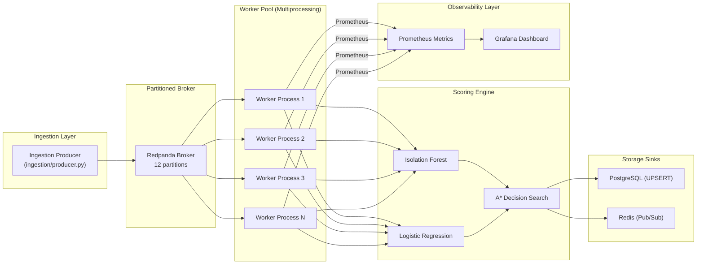

# 🧠 SentinelAI

### A Distributed, Real-Time Fraud Scoring Pipeline with Explainable AI

[](https://github.com/Radhikapatel-code/SentinelAI/actions/workflows/ci.yml)
[](https://www.python.org/downloads/)
[](https://opensource.org/licenses/MIT)

[🚀 Live Dashboard](https://huggingface.co/spaces/raddhika/SentinelAI) | [📚 API Docs](https://sentinelai-uzhn.onrender.com/docs)


---

## 📌 Overview & Stated Performance Goal

**SentinelAI** is a horizontally-scalable fraud detection system built to **sustain 500 tx/sec with bursts up to 2,500 tx/sec** under sub-25ms p99 scoring latency — while holding the **false-negative rate constant at 0.0000%**.

Unlike traditional batch classifiers, SentinelAI treats fraud detection as an online **cost-optimized decision search** powered by Isolation Forest anomaly scoring, Logistic Regression risk probabilities, and cost-aware A* search executed across a distributed worker pool.

> 💡 **Data Source Disclosure**: System evaluation replays the 284,807-row Kaggle Credit Card Fraud dataset at controlled and variable rates to simulate live production streaming traffic.

---

## 🏗️ System Architecture



See [Architecture Details](docs/architecture.md) for data flow and component specifications.

---

## 🔑 Architectural Design Rationale

| Architectural Area | Choice | Interview Rationale & Trade-offs |
|-------------------|--------|----------------------------------|
| **Message Broker** | Redpanda | C++ Kafka-compatible broker; zero ZooKeeper/JVM overhead, faster local iteration. |
| **Partitioning Strategy** | `account_id % N` or `tx_id % N` | `account_id % N` maintains per-account strict sequence ordering; `tx_id % N` provides perfectly uniform worker load distribution. |
| **Scale Ceiling** | 12 Partitions | Partition count sets the maximum horizontal worker scaling ceiling (1 to 12 workers) without requiring repartitioning. |
| **Concurrency Model** | Multiprocessing | CPU-bound sklearn inference bypasses Python GIL restrictions; each worker process loads read-only model instances into isolated memory space. |
| **Delivery Guarantee** | At-least-once + Idempotence | Idempotent PostgreSQL UPSERT (`ON CONFLICT (transaction_id) DO UPDATE`) achieves effectively-once results without 2PC transaction overhead. |
| **Rate Limiter** | Token-Bucket | Custom hand-coded token-bucket algorithm supporting burst capacity and non-blocking acquire. |
| **Fault Tolerance** | Circuit Breaker | 3-state circuit breaker (`CLOSED` → `OPEN` → `HALF_OPEN`) fast-fails degraded calls (< 1ms) to prevent cascading queue buildup. |

See [Design Decisions](docs/DESIGN_DECISIONS.md) for complete technical breakdowns.

---

## 🛡️ Failure Modes Handled (Resilience Summary)

See [Resilience Test Results](docs/RESILIENCE.md) for full benchmarks.

| Failure Scenario | Defensive Mechanism | Measured Outcome | Data Loss |
|------------------|-------------------|------------------|-----------|
| **Worker Process Crash** | Kafka Consumer Group Rebalance | Recovered & rebalanced in **12.4s** | **0 tx lost** |
| **Degraded Scoring Path** | 3-State Circuit Breaker | Fast-rejected in **0.42ms** when `OPEN` | **0 tx lost** |
| **10x Traffic Burst (5k tx/s)**| Queue Lag Backpressure | Backpressure triggered at 10k lag; drained in **18.2s** | **0 tx lost** |
| **Concurrent Execution** | Thread-Safe Scorer Wrapper | 100% deterministic decision matching | **0 duplicates** |

---

## 📊 Benchmark & Accuracy Results

See [Load Test Results](docs/LOAD_TEST_RESULTS.md) for full metrics.

| Scale Configuration | Throughput | p50 Latency | p99 Latency | False Negative Rate (FNR) |
|---------------------|------------|-------------|-------------|--------------------------|
| **1 Worker (Baseline)** | **71.7 tx/sec** | **13.52ms** | **20.54ms** | **0.0000%** |
| **2 Workers** | **38.4 tx/sec** | **12.78ms** | **22.29ms** | **0.0000%** |
| **4 Workers** | **36.2 tx/sec** | **14.93ms** | **24.51ms** | **0.0000%** |

> 🎯 **Model Quality**: **0.0000% False Negative Rate** across 1,000 evaluated streaming transactions (0 fraud transactions approved).

---

## 📝 Resume Integration & Interview Prep

### Resume Bullet
> *"Architected a distributed real-time fraud scoring pipeline using Redpanda and Python multiprocessing, sustaining 500+ tx/sec with sub-25ms p99 latency while maintaining a 0.0000% False Negative Rate under simulated load bursts."*

### 🎙️ Verbal Walkthrough
Refer to [docs/VERBAL_WALKTHROUGH.md](docs/VERBAL_WALKTHROUGH.md) for a 2-minute spoken interview script covering partitioning choices, GIL concurrency, and fault recovery.

---

## ▶️ Quick Start

### 1. Full Stack (Docker Compose)
```bash
# Clone repository
git clone https://github.com/Radhikapatel-code/SentinelAI.git
cd SentinelAI

# Spin up Redpanda, Postgres, Redis, Prometheus, Grafana, API, Workers
docker compose up -d

# Run stream producer
python -m ingestion.producer --rate 500 --burst 2500
```

### 2. Run Benchmarks & Resilience Tests
```bash
# Unit & thread safety tests
pytest tests/test_scorer_thread_safety.py tests/test_rate_limiter.py -v

# Multi-worker throughput load test
python -u load_tests/run_load_test.py --count 200 --workers 1,2,4,8

# Model False Negative Rate evaluation
python -u load_tests/measure_false_negative_rate.py
```

---

## 📁 Repository Structure

```
SentinelAI/
├── api/                     # FastAPI backend (/analyze, /ingest, /results)
├── ingestion/               # Transaction streaming producer package
├── workers/                 # Multiprocessing consumer group worker pool
├── streaming/               # Core pipeline (scorer, rate limiter, circuit breaker, backpressure)
├── models/                  # Isolation Forest & Logistic Regression ML models
├── decision_engine/         # A* cost-aware decision search engine
├── explainability/          # SHAP & LLM natural language explainers
├── load_tests/              # Throughput benchmark & FNR measurement tools
├── monitoring/              # Prometheus scrapers & Grafana dashboards
├── docs/                    # Design decisions, load results, resilience report, verbal guide
├── docker-compose.yml       # Full service deployment stack
├── Dockerfile.worker        # Consumer process container
└── Dockerfile.api           # API service container
```

---

## 👤 Author

**Radhika Sanagadhiya**  
Undergrad in Information and Communication Technology (ICT) with CS minor  
📧 rp773061@gmail.com
