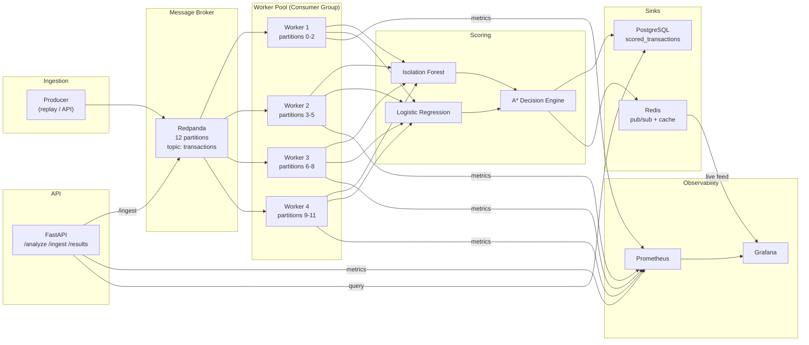
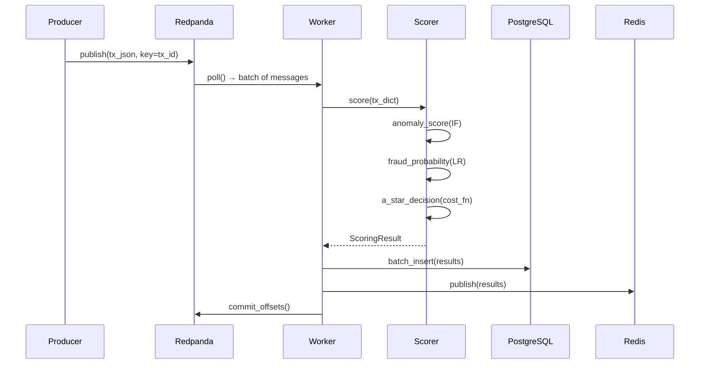

# SentinelAI — System Architecture

## High-Level Pipeline

## Component Responsibilities

### Producer (`streaming/producer.py`)
- Replays transaction dataset at configurable rate (tx/sec)
- Supports burst injection for spike simulation
- Idempotent writes (transaction ID as key)
- Partitions by `transaction_id % 12` for even distribution

### Redpanda (Message Broker)
- Kafka-compatible streaming platform
- 12 partitions on `transactions` topic
- Enables horizontal scaling up to 12 workers
- Provides consumer group coordination and offset management

### Worker Pool (`streaming/consumer.py`)
- Consumer group: `sentinel-scorers`
- Each worker is a separate **process** (multiprocessing, not threads)
- Owns a subset of partitions (auto-assigned by consumer group protocol)
- Loads models once at startup, scores in a tight loop
- Commits offsets only after successful sink write (at-least-once)

### Scorer (`streaming/scorer.py`)
- Wraps existing Isolation Forest + Logistic Regression + A* search
- Stateless after initialization → safe for concurrent use
- No SHAP/LLM in hot path (available on-demand via API)

### Sinks (`streaming/sink.py`)
- **PostgreSQL**: Persistent storage, batch inserts, queryable history
- **Redis**: Pub/sub for real-time dashboard, LRU cache for recent results

### FastAPI (`api/main.py`)
- `/ingest`: Alternative ingestion via HTTP (publishes to Redpanda)
- `/analyze`: Synchronous single-transaction scoring (existing)
- `/results/{id}`: Query scored results from PostgreSQL
- `/health`: System health including queue depth, circuit breaker state
- Protected by token-bucket rate limiter and circuit breaker

### Observability
- **Prometheus**: Scrapes worker + API metrics every 15s
- **Grafana**: Live dashboard with throughput, latency percentiles, queue depth, false negative rate

## Key Design Decisions

| Decision | Choice | Why |
|----------|--------|-----|
| Broker | Redpanda | No ZooKeeper, single binary, same Kafka protocol |
| Partitions | 12 | Scale 1→12 workers; one-way door, chosen deliberately high |
| Partition key | `transaction_id % N` | Even distribution; scoring is stateless per-tx, no ordering needed |
| Concurrency | Multiprocessing | CPU-bound scoring (sklearn); GIL prevents thread parallelism |
| Delivery | At-least-once | Simpler than exactly-once; sink is idempotent (UPSERT on tx_id) |
| Rate limiting | Custom token-bucket | Interviewable implementation; burst-tolerant |
| Failure handling | Circuit breaker | Fail fast under degraded scoring, don't queue indefinitely |

## Data Flow (Single Transaction)

